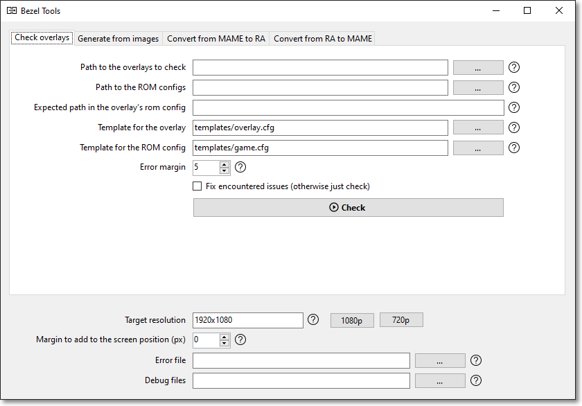

# Retroarch bezels / overlays tool

Overlays (or bezels) are images added "above" the emulator, to mask the black borders around the image.

This tool provides several utilities:

- check Retroarch overlays integrity (ex: you have lots of overlays and some of them are broken)
- convert MAME bezels to Retroarch overlays, so they can be used with any Libretro emulator (ex: you've found great MAME bezels and want to use them under Recalbox/Retropie)
- convert Retroarch overlays to MAME bezels (ex: you've found great RA bezels but prefer to use MAME)
- generate Retroarch overlays from images (ex: you've found great overlay image but they don't have associated configs)

It works under Windows, Linux and MacOS, except the GUI which only works on Windows.

## Download

**[Download the latest release](https://github.com/cosmo0/mame-retroarch-bezel-converter/releases)**

---

## Usage

**!!! BACKUP YOUR FILES BEFORE USING THIS TOOL !!!**  
I have used it on my own files but I cannot guarantee that it will work on yours.

### GUI

The GUI is only available on Windows (sorry but multi-platform GUI is a pain).

The various possibilities are grouped in tabs. Just select your action, enter the values, and click the button.

### Command line

Get a list of possible actions using `bezel-tools --help`.  
Get a detailed list of options for each action using `bezel-tools [verb] --help`.

[Detailed list of actions and parameters](doc/details.md)

### Documentation

Overlays and bezels are two different words for describing basically the same thing; RA use overlays, MAME use bezels.

[How RetroArch overlays files work](doc/overlays.md)

[How MAME bezels files work](doc/bezels.md)

### Development

Details about building, publishing and debugging the app are located in [doc/dev.md](doc/dev.md).

## Contribute

Don't hesitate to create issues or pull requests. I can't guarantee I'll be quick to respond to them (it might actually take a few years) but they are welcome anyway.

## License

This app uses the MIT license. You're free to use it in any project, open source or not, paid or not.

You can fork it, use part of the code, sell it, whatever, have fun.

Please do let me know if it's been useful to you, though. It'll make me happy.
