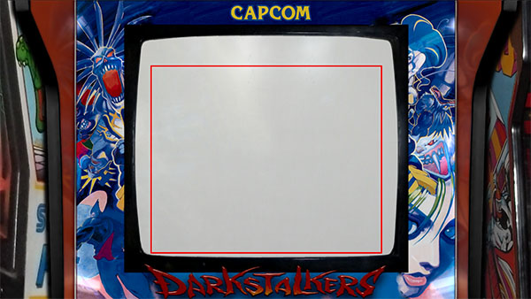

# Retroarch bezels / overlays tool

[](https://ci.appveyor.com/project/cosmo0/mame-retroarch-bezel-converter)

Overlays (or bezels) are images added "above" the emulator, to mask the black borders around the image.

This tool provides several utilities:

- convert MAME bezels to Retroarch overlays, so they can be used with any Libretro emulator
- convert Retroarch overlays to MAME bezels
- check Retroarch overlays integrity
- generate Retroarch overlays from images

It works under Windows x64/ARM64, Linux x64/ARM64 and MacOS x64. You can build it for any platform supported by .Net 5 (it's very easy).

## Download

**[Download the latest release](https://github.com/cosmo0/mame-retroarch-bezel-converter/releases)**

---

## Usage

**!!! BACKUP YOUR FILES BEFORE USING THIS TOOL !!!** I have used it on my own files but I cannot guarantee that it will work on yours.

Get a list of possible actions using `bezel-tools --help`.  
Get a detailed list of options for each action using `bezel-tools [verb] --help`.

### Check overlays integrity

Checks that:

- the rom config points to an existing overlay
- the overlay config points to an existing image
- all images in the overlays folder have an associated overlay config and rom config, and can create one
- all overlay configs are used by a rom config, and can create one
- the path written in the config matches the expected one (to check overlays that will be used on another machine)
- the image has a size matching the output resolution
- the coordinates of the game in the rom config match the transparency in the image

It assumes that rom config are named `xxxx.zip.cfg`, and images are stored in the same folder as the overlay config.

**Simple check:**

> bezel-tools check --overlays-config samples/retroarch/overlays --roms-config samples/retroarch/roms --output-debug debug/

- `--overlay-config` is the path where the overlays are (cfg files and images)
- `--roms-config` is the path to the cfg files for the roms
- `--output-debug` is the path to the debug images, to see what will be computed

Example of debug output from configuration:



Example of debug output computed from transparency in image:


**Check and fix when possible:**

> bezel-tools check --overlays-config samples/retroarch/overlays --roms-config samples/retroarch/roms --autofix --input-overlay-path /opt/retropie/configs/all/retroarch/overlay/ --template-overlay templates/overlay.cfg --template-rom templates/game.cfg

- `--overlay-config` is the path where the overlays are (cfg files and images)
- `--roms-config` is the path to the cfg files for the roms
- `--autofix` fixes encountered problems
- `--input-overlay-path` is the expected path to the overlay in the rom config (ex: /opt/retropie/configs/all/retroarch/overlay/ for a Retropie overlay)
- `--template-overlay` is the path to the overlay template
- `--template-rom` is the path to the rom template

### Generate overlays from images

Generates overlay and rom configs based on the position of the screen transparent area, and the file name.

> bezel-tools generate --images samples/images --roms-configs samples/roms --template-overlay templates/overlay.cfg --template-rom templates/game.cfg

- `--images` is the path to the images folder (the overlay configs will be generated inside)
- `--roms-configs` is the path to the rom configs folder
- `--template-overlay` is the path to the overlay template
- `--template-rom` is the path to the rom template

### Convert MAME bezels to RetroArch overlays

Scans a folder containing MAME bezel files (it can scan zip files), and converts the content to a Retroarch overlay.

It can also read apply offsets stored in MAME configs.

> bezel-tools mtr --source path/to/mame/zips --output-roms output/roms --output-overlays output/overlay --template-game templates/game.cfg --template-overlay templates/overlay.cfg

- `--source` is the path where you store your zip files containing your MAME bezels
- `--output-overlays` is where the png and overlay cfg files will be created
- `--output-roms` is where rom cfg files will be created (where the screen dimensions are stored)
- `--template-game` is a template rom cfg that will be modified (a sample is provided)
- `--template-overlay` is a template overlay cfg that will be modified (a sample is provided)
- `--overwrite` to overwrite existing files

### Convert RetroArch overlays to MAME bezels

Scans a folder containing Retroarch overlays and converts them to MAME bezels.

> bezel-tools rtm --source-roms path/to/rom/files --source-configs path/to/config/files --output path/to/output --template templates/default.lay --zip

- `--source-roms` is the path to the rom cfg (the .zip.cfg files)
- `--source-configs` is the path to the folder where the cfg files are located
- `--output` is where the MAME bezels will be created
- `--template` is the template for the lay file that will be modified (a sample is provided)
- `--zip` zips the result (otherwise it just creates a folder)
- `--overwrite` to overwrite existing files

### Common parameters for all actions

- `--error-file path/to/file.csv` the path to the output CSV file containing the errors and fixes
- `--output-debug path/to/debug` to see the result of the conversion (it creates an image with a red square where the screen will be)
- `--margin 10` to add or remove a 10px margin to the screen position (positive value to crop a bit of the screen)
- `--threads 4` to use 4 threads

---

## Development

You'll need to install the [.Net 5 SDK](https://dotnet.microsoft.com/download/dotnet/5.0).

### Build

`dotnet build src/BezelTools.sln`

### Run

**Simple check:**

`dotnet run -p src/BezelTools.csproj -- check
    --overlays-config tmp/retroarch/configs
    --roms-config tmp/retroarch/roms
    --threads 4
    -e tmp/errors.csv
    --error-margin 10`

**Check and fix:**

`dotnet run -p src/BezelTools.csproj -- check
    --overlays-config tmp/retroarch/configs
    --roms-config tmp/retroarch/roms
    --autofix
    --input-overlay-path /opt/retropie/configs/all/retroarch/overlay/arcade-realistic
    --template-overlay src/templates/overlay.cfg
    --template-rom src/templates/game.cfg
    --threads 4
    -e tmp/errors.csv
    -d tmp/debug
    --margin 5
    --error-margin 10`

**Generate from images:**

`dotnet run -p src/BezelTools.csproj -- generate
    --images tmp/images
    --roms-config tmp/output/roms
    --template-overlay src/templates/overlay.cfg
    --template-rom src/templates/game.cfg
    -e tmp/errors.csv
    -d tmp/debug
    --threads 4`

**MAME to RA conversion:**

`dotnet run -p src/BezelTools.csproj -- mtr
    --source tmp/source_mame
    --source-configs tmp/source_mame
    --output-roms tmp/output/roms_ra
    --output-overlays tmp/output/overlay_ra
    --template-game src/templates/game.cfg
    --template-overlay src/templates/overlay.cfg
    --overwrite
    --scan-bezel
    --output-debug tmp/debug_ra
    --margin 10
    --threads 4
    -e tmp/errors.csv`

**RA to MAME conversion:**

`dotnet run -p src/BezelTools.csproj -- rtm
    --source-roms tmp/source_ra/roms
    --source-configs tmp/source_ra/configs
    --output tmp/output/mame
    --template src/templates/default.lay
    --zip
    --overwrite
    --scan-bezel
    --output-debug tmp/debug_mame
    --margin 10
    --threads 4
    -e tmp/errors.csv`

### Publish

````shell
dotnet publish src/BezelTools.sln -r win-x64 -p:PublishSingleFile=true --self-contained true -o out/win-x64
dotnet publish src/BezelTools.sln -r win-arm64 -p:PublishSingleFile=true --self-contained true -o out/win-arm64
dotnet publish src/BezelTools.sln -r linux-x64 -p:PublishSingleFile=true --self-contained true -o out/linux-x64
dotnet publish src/BezelTools.sln -r linux-arm64 -p:PublishSingleFile=true --self-contained true -o out/linux-arm64
dotnet publish src/BezelTools.sln -r osx-x64 -p:PublishSingleFile=true --self-contained true -o out/osx-x64
````

---

## Contribute

Lay file specs are located in [lay_file_specs.md](lay_files_specs.md).

It's a regular .Net console app. It uses [CommandLine](https://github.com/commandlineparser/commandline)
to parse arguments and execute the right verb.

It's not a very complex app, no surprises.

## License

This app uses the MIT license. You're free to use it in any project, open source or not, paid or not.

You can fork it, use part of the code, whatever, have fun.

Please do let me know if it's been useful to you, though, it'll make me happy.
